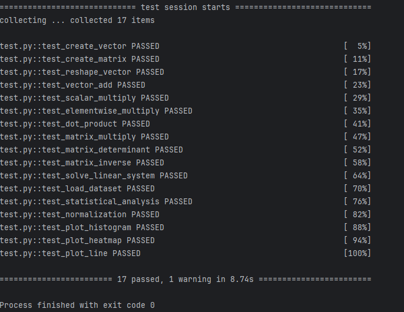

# Лабораторная работа №2 по Python

## Задача
Научиться использовать **NumPy** и строить графики.

## Как решал
Для решения использовал подсказки к функциям (help(), документация). Также уже имел опыт работы с NumPy, Matplotlib и Seaborn

Поэтому проблем с реализацией не возникло.

## Нюансы
При решении столкнулся с тем, что не очень хорошие получаются графики из тестов из-за входных значений. Например, оценки по условию учитываются с 1 до 5, а в тесте присутствует значение 6.

Но в рамках лабораторной работы на это можно закрыть глаза.

## Результат тестирования
Все функции успешно проходят тесты.

### 📸 Скриншот прохождения тестов:

## Код
Исходный код лабораторной работы можно посмотреть в репозитории.
